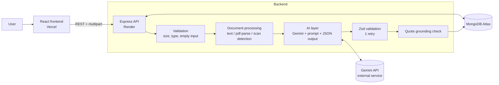

# AI Clinical Document Reviewer

A web app that takes clinical documentation (typed text, an image, or a PDF; typed, scanned or handwritten) and produces a structured clinical review: a short report summary plus a detailed breakdown of symptoms, diagnoses, medications, vitals, allergies, concerns, missing information and possible inconsistencies. Completed analyses are stored and can be reopened later.

**All clinical data used in this project is synthetic.**

- Live app: `<ADD FRONTEND URL>`
- API: `<ADD BACKEND URL>` (health check: `/api/health`)
- Note: the backend runs on a free tier and may take up to a minute to wake up on the first request.

## Features

- Three input types: pasted text, image upload (PNG/JPG/WebP), PDF upload
- Typed PDFs are parsed directly; scanned PDFs and images are read by a multimodal model
- Report summary first, then detailed structured sections
- Per-item confidence and a verbatim source quote for every extracted fact
- Automatic check that quotes really appear in the document text; unmatched items are downgraded and flagged
- Detection of missing information, inconsistencies (for example a penicillin allergy with amoxicillin prescribed) and items needing review
- Clear handling of unreadable or non-clinical documents
- History of past reports with date, status, summary and full detail
- Loading and error states for every failure path

## Tech stack

| Layer | Technology |
|---|---|
| Frontend | React 18, Vite (hosted on Vercel) |
| Backend | Node.js, Express, Multer, Zod (hosted on Render) |
| Database | MongoDB Atlas via Mongoose |
| PDF text | pdf-parse |
| AI | Google Gemini (multimodal, JSON output) via `@google/genai` |

## Repository structure

```
backend/
  src/
    server.js              app setup, CORS, routes, DB connection
    config.js              environment configuration
    routes/analyses.js     POST/GET endpoints and the processing flow
    services/extract.js    file-type sniffing, PDF text extraction, scan detection
    services/gemini.js     prompt, model call, retry, error mapping
    services/schema.js     Zod schema for the report
    services/ground.js     quote-grounding check
    services/selftest.js   offline check of schema + grounding
    models/Analysis.js     Mongoose model
    middleware/            upload (multer) and error handling
frontend/
  src/
    App.jsx  api.js  sample.js  styles.css
    components/NewAnalysis.jsx  History.jsx  ReportView.jsx
```

## Architecture



Flow: Input, then validation, then extraction, then AI analysis, then schema validation and grounding, then persistence, then the report is returned to the UI. Failures after extraction are saved with status `failed`, so they show up in history.

## API

| Method | Path | Description |
|---|---|---|
| POST | `/api/analyses` | multipart form with `text` or `file`; returns the completed analysis |
| GET | `/api/analyses` | list of past analyses (no full report) |
| GET | `/api/analyses/:id` | one analysis with the full report |
| GET | `/api/health` | service and database status |

Success: `{ "success": true, "data": ... }`. Error: `{ "success": false, "error": { "code": "...", "message": "..." } }`.

## Configuration

Backend (`backend/.env`, see `.env.example`):

| Variable | Purpose |
|---|---|
| `MONGODB_URI` | MongoDB Atlas connection string |
| `GEMINI_API_KEY` | Google AI Studio API key |
| `GEMINI_MODEL` | Model name, default `gemini-2.5-flash` |
| `CLIENT_URL` | Allowed frontend origin(s), comma-separated, no trailing slash |
| `PORT` | Default 5000 |

Frontend (`frontend/.env`): `VITE_API_URL` is the backend base URL.

## Run locally

```bash
# backend
cd backend
cp .env.example .env      # fill in values
npm install
npm run dev               # http://localhost:5000

# frontend (new terminal)
cd frontend
cp .env.example .env
npm install
npm run dev               # http://localhost:5173
```

Database: no manual setup. Create a free MongoDB Atlas cluster, allow your IP (or 0.0.0.0/0 for the demo), and paste the connection string into `MONGODB_URI`. The collection is created automatically.

Quick offline check of the schema and grounding logic: `cd backend && npm run test:schema`.

## Deploy

- Backend on Render: root directory `backend`, build `npm install`, start `npm start`, set the environment variables above. Set `CLIENT_URL` to the Vercel URL.
- Frontend on Vercel: root directory `frontend`, framework Vite, set `VITE_API_URL` to the Render URL.

## Screenshots

`<ADD SCREENSHOTS: new review form, report summary, detailed report, past reports, error state>`

## Known limitations

- Processing is synchronous, so very large documents can hit the request timeout on free hosting.
- The grounding check only works when there is a text layer (typed text, typed PDFs). For images and scanned PDFs, confidence comes from the model alone.
- Handwriting accuracy depends on the model and image quality; low-confidence items are flagged but not guaranteed to be caught.
- No authentication: anyone with the URL can see all reports. Acceptable only because all data is synthetic.
- No rate limiting, so the API key could be exhausted by heavy use.
- No formal evaluation set; verified manually on synthetic documents.
- This is a review aid, not a diagnostic tool.
